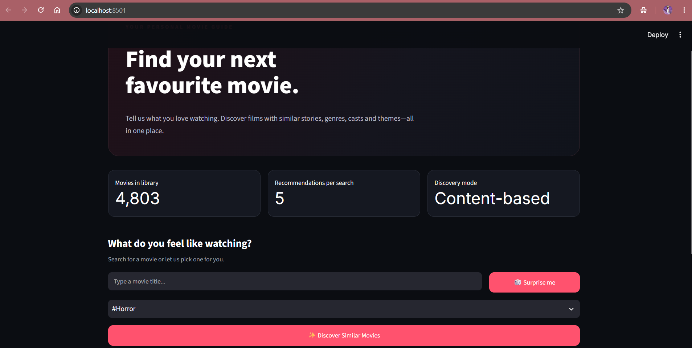
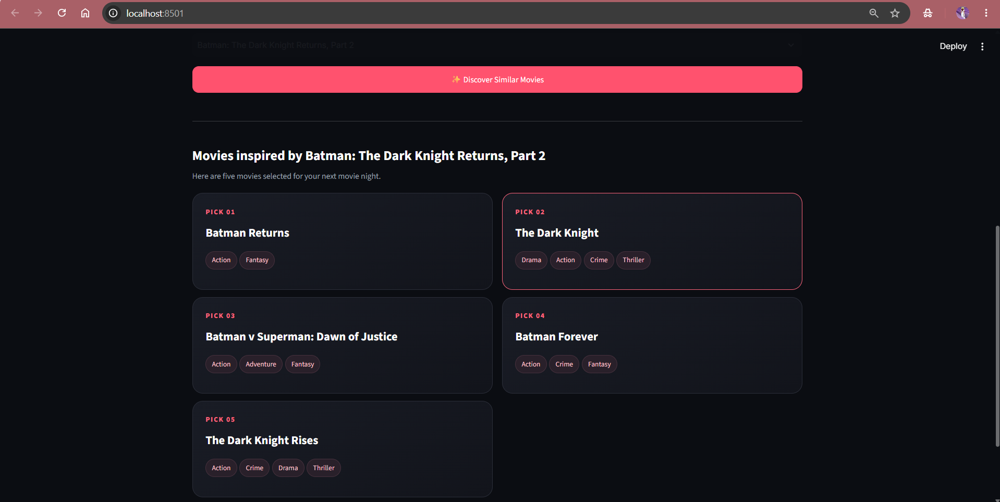
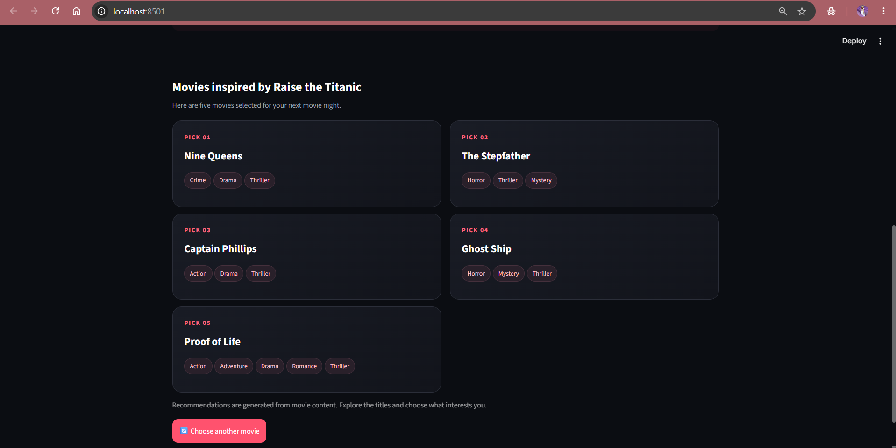
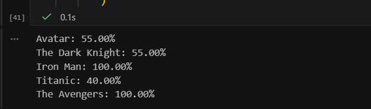

# 🎬 Movie Recommendation System

A content-based movie recommendation system built using Python, Scikit-learn, and Streamlit. It recommends movies based on similarities in their genres, keywords, plot overviews, cast, and directors.

The project uses the TMDB 5000 Movie Dataset and combines text preprocessing, TF-IDF vectorization, and cosine similarity to discover movies related to a user's selected title.

## 🚀 Live Demo

Try the deployed application:

[🎬 Movie Recommendation System](https://goudalija44-cloud-movie-recommendation-system-using--app-pfpr8d.streamlit.app/)

## 📌 Project Overview

Finding a movie to watch can be difficult when there are thousands of options. This project helps users discover relevant movies by selecting a movie they already like and receiving five similar recommendations.

### Objectives

* Build a content-based movie recommendation engine.
* Process movie metadata into meaningful text features.
* Convert text into numerical vectors using TF-IDF.
* Calculate movie similarity using cosine similarity.
* Evaluate recommendations using genre overlap.
* Deploy the recommendation engine through a Streamlit web application.

## ✨ Key Features

* Search and select movies from the dataset.
* Get five movie recommendations for a selected title.
* Discover recommendations based on movie content.
* View movie genres alongside recommendations.
* Use the interactive Streamlit application.
* Evaluate recommendation relevance through genre overlap.

## 🗂️ Dataset

**Dataset:** TMDB 5000 Movie Dataset

**Source:** [TMDB 5000 Movie Dataset on Kaggle](https://www.kaggle.com/datasets/tmdb/tmdb-movie-metadata)

The dataset includes movie metadata and credits, such as titles, genres, keywords, plot overviews, cast members, and crew information.

The movie and credits CSV files are merged using their movie IDs.

## 🧠 Machine Learning Methodology

### 1. Data preprocessing

* Load the movies and credits CSV files using Pandas.
* Merge the datasets using movie IDs.
* Remove duplicate records and handle missing text values.
* Extract genre and keyword names.
* Extract the top three cast members.
* Extract the director from the crew data.
* Combine the selected information into a single text feature called `tags`.

### 2. Feature extraction using TF-IDF

TF-IDF (Term Frequency–Inverse Document Frequency) transforms the combined movie tags into numerical feature vectors.

The implementation uses Scikit-learn's `TfidfVectorizer` with English stop-word removal and a maximum feature limit of 5,000.

### 3. Similarity calculation

Cosine similarity measures how similar the movie feature vectors are.

When a user selects a movie, the system compares its TF-IDF vector with the vectors of other movies and retrieves the five highest-scoring matches, excluding the selected movie itself.

### 4. Recommendation output

The application displays the recommended movie titles and their genres. Similarity scores are used internally for ranking and are not displayed in the user interface.

## 📊 Evaluation

The system is evaluated using a custom **genre-overlap score**.

For each selected movie, the evaluation measures the proportion of its genres that also appear in each recommended movie. The proportions are averaged across the top five recommendations.

This helps assess genre consistency, but it is not classification accuracy or a measure of actual user satisfaction. The system has not been evaluated against real user preferences or a ground-truth recommendation dataset.

## 🖥️ Application Screenshots

### Main Application



### Recommendations for The Dark Knight



### Recommendations for Titanic



### Model Evaluation



## 🛠️ Technologies Used

* **Python** — programming language
* **Pandas** — data loading and preprocessing
* **NumPy** — numerical computing
* **Scikit-learn** — TF-IDF and cosine similarity
* **Joblib** — saving and loading model components
* **Streamlit** — interactive web application
* **Google Colab** — model development and experimentation
* **Git and GitHub** — version control and project hosting

## 📁 Project Structure

```text
## 📁 Project Structure

```text
movie_recommendation_system_using_streamlit/
│
├── data/
│   ├── tmdb_5000_movies.csv
│   └── tmdb_5000_credits.csv
│
├── notebooks/
│   └── movie_recommendation_using_streamlit.ipynb
│
├── models/
│   ├── movies.pkl
│   ├── tfidf_vectorizer.pkl
│   └── tfidf_matrix.pkl
│
├── screenshots/
│   ├── main_page.png
│   ├── recommendations.png
│   ├── avatar_recommendations.png
│   └── model_evaluation.png
│
├── app.py
├── requirements.txt
├── README.md
└── .gitignore
```

## ⚙️ Installation and Setup

### Prerequisites

* Python 3.10 or a compatible Python version
* pip
* Git (optional, for cloning the repository)

### 1. Clone the repository

```bash
git [View Source Code](https://github.com/goudalija44-cloud/movie-recommendation-system-using-streamlit)
cd movie_recommendation_system
```


### 2. Create a virtual environment (recommended)

Windows:

```bash
python -m venv .venv
.venv\Scripts\activate
```

### 3. Install dependencies

```bash
python -m pip install -r requirements.txt
```

### 4. Run the application

```bash
python -m streamlit run app.py
```

Open the local URL printed in your terminal, usually `http://localhost:8501`.

**Important:** The three saved `.pkl` files must be present in the project directory for the application to run. If they are hosted separately, download them and place them in the expected location before starting the app.

## 🚀 Future Improvements

* Add movie posters and richer movie metadata.
* Explore ranking methods beyond content similarity.
* Evaluate recommendations using a suitable relevance dataset.
* Add collaborative filtering when user interaction data becomes available.
* Build a FastAPI version that reuses the same recommendation engine.
* Deploy the application online.

## 📚 Learning Outcomes

Through this project, I practised:

* Data cleaning and feature engineering.
* Working with structured movie metadata.
* Text preprocessing and TF-IDF vectorization.
* Vector similarity and content-based filtering.
* Building and evaluating a recommendation pipeline.
* Saving model components and integrating them into Streamlit.

## 📄 License and Dataset Attribution

This project is intended for educational and portfolio purposes. Refer to the dataset provider's terms and applicable TMDB attribution requirements before redistributing the data or deploying the application publicly.
